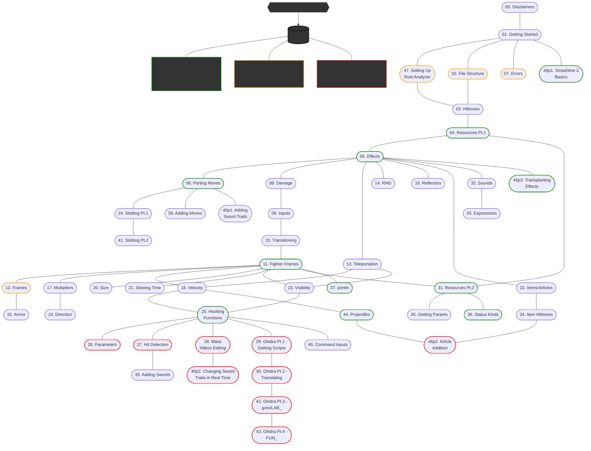

## Episode Order

```mermaid
graph TD;
%% General
    %% Class Declarations
    classDef default stroke-width:1.5px;
    classDef toolTip fill: #333, stroke: black
    classDef hlG stroke: green
    classDef hlY stroke: orange
    classDef hlR stroke: red
    classDef hlW stroke: white

%% Tooltips
    %% Declarations
    tt1{{Flowchart is currently a WIP}}
    tt2[(Outlines:)]
    tt3[Green outlines are episodes \n I've deemed incredibly useful]
    tt4[Yellow outlines denote highly recommended, \n but optional episodes]
    tt5[Red outlines denote advanced topics \n not for beginners]
    %% Todo: Add some notes about where to start 

    %% Connections
    tt1 --> tt2
    tt2 --- tt3
    tt2 --- tt4
    tt2 --- tt5

    %% Class Additions
    class tt1,tt2,tt3,tt4,tt5 toolTip
    class tt1 hlW
    class tt3 hlG
    class tt4 hlY
    class tt5 hlR

%% Episodes
    %% Declarations
    00([00. Disclaimers])
    01([01. Getting Started])
    02([02. File Structure]):::hlY
    03([03. Hitboxes])
    04([04. Resources Pt.1]):::hlG
    05([05. Effects]):::hlG
    06([06. Porting Moves]):::hlG
    07([07. Errors]):::hlY
    08([08. Damage])
    09([09. Inputs])
    10([10. Transitioning])
    11([11. Fighter Frames]):::hlG
    12([12. Frames]):::hlY
    13([13. Teleportation])
    14([14. RNG])
    15([15. Armor])
    16([16. Reflectors])
    17([17. Multipliers])
    18([18. Velocity])
    19([19. Direction])
    20([20. Size])
    21([21. Slowing Time])
    22([22. Items/Articles])
    23([23. Visibility])
    24([24. Slotting Pt.1])
    25([25. Hooking \n Functions]):::hlG
    26([26. Parameters]):::hlR
    27([27. Hit Detection]):::hlR
    28([28. Mass \n Hitbox Editing]):::hlR
    29([29. Ghidra Pt.1 - \n Getting Scripts]):::hlR
    30([30. Ghidra Pt.2 - \n Translating]):::hlR
    31([31. Resources Pt.2]):::hlG
    32([32. Sounds])
    33([33. Expressions])
    34([34. Item Hitboxes])
    35([35. Getting Params])
    36([36. Status Kinds]):::hlG
    37([37. println]):::hlG
    38([38. Adding Moves])
    39([39. Adding Swords])
    40.1([40p1. Adding \n Sword Trails])
    40.2([40p2. Changing Sword \n Trails in Real Time]):::hlR
    41([41. Slotting Pt.2])
    42([42. Ghidra Pt.3 - \n goto/LAB_]):::hlR
    43([43. Ghidra Pt.4 - \n FUN_]):::hlR
    44([44. Projectiles]):::hlG
    45([45. Command Inputs])
    46.1([46p1. Smashline 2 \n Basics]):::hlG
    46.2([46p2. Article \n Addition]):::hlR
    46.3([46p3. Transplanting \n Effects]):::hlG
    47([47. Setting Up \n Rust Analyzer]):::hlY

    %% Connections
    %%ttStart{{Start Here!}}:::hlW--- don't know if I like this or not yet
    00---01
    01---47
    01---02
    02---03
    47---03
    03---04
    04---05
    05---06
    01---07
    05---08
    08---09
    09---10
    10---11
    11---12
    05---13
    05---14
    12---15
    05---16
    11---17
    13---18
    11---18
    17---19
    11---20
    11---21
    05---22
    11---23
    13---23
    06---24
    18---25
    23---25
    25---26
    25---27
    25---28
    25---29
    29---30
    04---31
    11---31
    05---32
    32---33
    22---34
    31---35
    31---36
    11---37
    06---38
    27---39
    06---40.1
    28---40.2
    24---41
    30---42
    42---43
    18---44
    25---45
    01---46.1
    34---46.2
    44---46.2
    05---46.3
```
