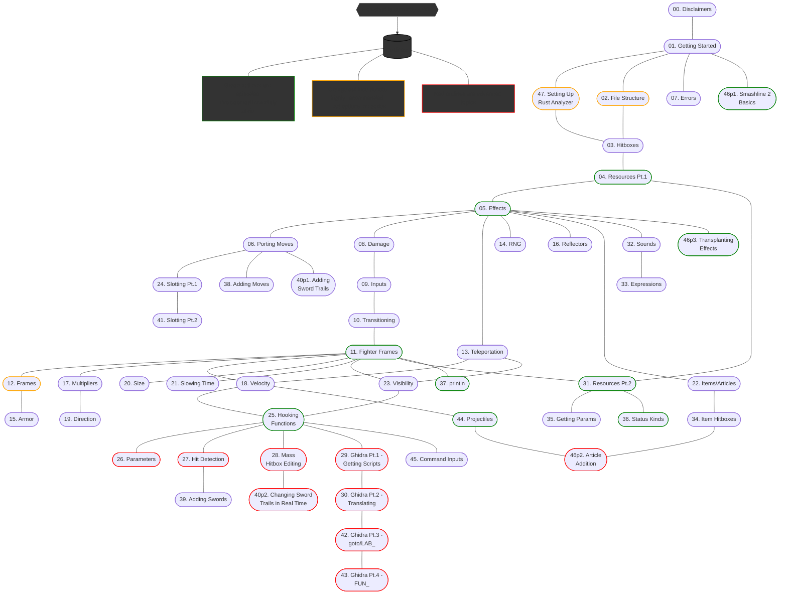

## Episode Order

```mermaid
graph TD;
%% General
    %% Class Declarations
    classDef default stroke-width:1.5px;
    classDef toolTip fill: #333, stroke: black
    classDef hlG stroke: green
    %% Todo: something with this
    classDef hlY stroke: yellow
    classDef hlO stroke: orange
    classDef hlR stroke: red
    classDef hlW stroke: white

%% Tooltips
    %% Declarations
    tt1{{Flowchart is currently a WIP}}
    tt2[(Outlines:)]
    tt3[Green outlines are episodes \n I've deemed incredibly useful]
    tt4[Orange outlines denote highly recommended, \n but optional episodes]
    tt5[Red outlines are advanced topics]
    %% Todo: Add some notes about 1. where to start 
    %% and 2. how some episodes aren't technically needed 
    %% (ie 06 prereq for 40) but are just recommended based on 
    %% the amount of knowledge you should have (try dotted lines?)

    %% Connections
    tt1 --> tt2
    tt2 --- tt3
    tt2 --- tt4
    tt2 --- tt5

    %% Class Additions
    class tt1,tt2,tt3,tt4,tt5 toolTip
    class tt1 hlW
    class tt3 hlG
    class tt4 hlO
    class tt5 hlR

%% Episodes
    %% Declarations
    00([00. Disclaimers])
    01([01. Getting Started])
    02([02. File Structure])
    03([03. Hitboxes])
    04([04. Resources Pt.1])
    05([05. Effects])
    06([06. Porting Moves])
    07([07. Errors])
    08([08. Damage])
    09([09. Inputs])
    10([10. Transitioning])
    11([11. Fighter Frames])
    12([12. Frames])
    13([13. Teleportation])
    14([14. RNG])
    15([15. Armor])
    16([16. Reflectors])
    17([17. Multipliers])
    18([18. Velocity])
    19([19. Direction])
    20([20. Size])
    21([21. Slowing Time])
    22([22. Items/Articles])
    23([23. Visibility])
    24([24. Slotting Pt.1])
    25([25. Hooking \n Functions])
    26([26. Parameters])
    27([27. Hit Detection])
    28([28. Mass \n Hitbox Editing])
    29([29. Ghidra Pt.1 - \n Getting Scripts])
    30([30. Ghidra Pt.2 - \n Translating])
    31([31. Resources Pt.2])
    32([32. Sounds])
    33([33. Expressions])
    34([34. Item Hitboxes])
    35([35. Getting Params])
    36([36. Status Kinds])
    37([37. println])
    38([38. Adding Moves])
    39([39. Adding Swords])
    40.1([40p1. Adding \n Sword Trails])
    40.2([40p2. Changing Sword \n Trails in Real Time])
    41([41. Slotting Pt.2])
    42([42. Ghidra Pt.3 - \n goto/LAB_])
    43([43. Ghidra Pt.4 - \n FUN_])
    44([44. Projectiles])
    45([45. Command Inputs])
    46.1([46p1. Smashline 2 \n Basics])
    46.2([46p2. Article \n Addition])
    46.3([46p3. Transplanting \n Effects])
    47([47. Setting Up \n Rust Analyzer])

    %% Connections
    %%ttStart{{Start Here!}}:::hlW--- don't know if I like this or not yet
    00---01
    01---47
    01---02
    02---03
    47---03
    03---04
    04---05
    05---06
    01---07
    05---08
    08---09
    09---10
    10---11
    11---12
    05---13
    05---14
    12---15
    05---16
    11---17
    13---18
    11---18
    17---19
    11---20
    11---21
    05---22
    11---23
    13---23
    06---24
    18---25
    23---25
    25---26
    25---27
    25---28
    25---29
    29---30
    04---31
    11---31
    05---32
    32---33
    22---34
    31---35
    31---36
    11---37
    06---38
    27---39
    06---40.1
    28---40.2
    24---41
    30---42
    42---43
    18---44
    25---45
    01---46.1
    34---46.2
    44---46.2
    05---46.3

    %% Class Additions
    %% Todo: Organize this section
    class 46.1 hlG
    class 47 hlO
    class 02 hlO
    class 04 hlG
    class 05 hlG
    class 31 hlG
    class 11 hlG
    class 12 hlO
    class 37 hlG
    class 44 hlG
    class 36 hlG
    class 25 hlG
    class 29 hlR
    class 30 hlR
    class 42 hlR
    class 43 hlR
    class 26 hlR
    class 27 hlR
    class 28 hlR
    class 40.2 hlR
    class 46.2 hlR
    class 46.3 hlG
```
