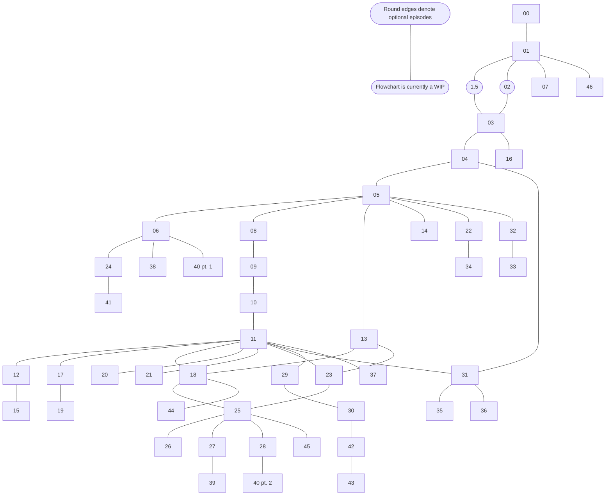

## Episode Order

```mermaid
graph TD;
    tt1([Round edges denote optional episodes]) ---- tt2([Flowchart is currently a WIP]);
    %% Todo: add titles next to episode numbers
    00---01;
    01---1.5([1.5]);
    01---02([02]);
    02---03;
    1.5---03;
    03---04;
    04---05;
    05---06;
    01---07;
    05---08;
    08---09;
    09---10;
    10---11;
    11---12;
    05---13;
    05---14;
    12---15;
    03---16;
    11---17;
    13---18;
    11---18;
    17---19;
    11---20;
    11---21;
    05---22;
    11---23;
    13---23;
    06---24;
    18---25;
    23---25;
    25---26;
    25---27;
    25---28;
    11---29;
    29---30;
    04---31;
    11---31
    05---32;
    32---33;
    22---34;
    31---35;
    31---36;
    11---37;
    06---38;
    27---39;
    40.1[40 pt. 1];
    40.2[40 pt. 2];
    06---40.1;
    28---40.2;
    24---41;
    30---42;
    42---43;
    18---44;
    25---45;
    01---46;
    %% Todo: split 46 into three parts in the diagram
```