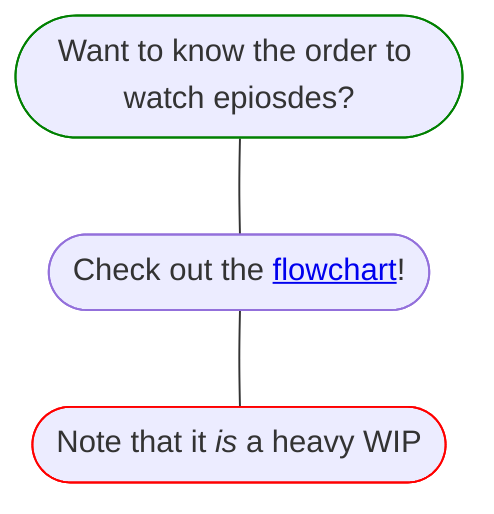

# Smash Ultimate Modding Workshop
The Smash Ultimate Mod Workshop is the series where I go over everything from getting started to editing status scripts.

[Here's](https://www.youtube.com/playlist?list=PLJ8C0Hk2ZKHvxjfFylRUIbVnDUvxLdejh) a link to the playlist

## List of episodes and what's covered in them: 
### 1. Getting Started
- Setting up a workspace to start code modding
### 2. Basic File Structure
- How hitbox scripts are composed
### 3. Changing Hitbox Data
- macros::ATTACK and its parameters
### 4. My Resources Part 1
- [WuBoy's script dump](https://github.com/WuBoytH/SSBU-Dumped-Scripts/tree/main/smashline)
- cpp.rs and lua_const.rs files
- [Smash Ultimate Modding Discord](https://discord.gg/ASJyTrZ)
- [Ultimate Frame Data](https://ultimateframedata.com/)
- [SSBWiki](https://www.ssbwiki.com/)
- [Smash Ultimate Tools](https://smashultimatetools.com/)
- [Hash List](https://raw.githubusercontent.com/ultimate-research/param-labels/master/ParamLabels.csv)
- [Rust Docs](https://ultimate-research.github.io/skyline-rs-template/doc/smash/index.html)
- [AnimCMD Spreadsheet](https://docs.google.com/spreadsheets/d/1q_TpWoQkr9YWgQ7fc3JpHuU9zKfCLtl80Uodcyc0NPY/edit#gid=0)
- Github
### 5. Effects & Backgrounds
- macros::FOOT_EFFECT
- macros::EFFECT_FOLLOW
- macros::AFTER_IMAGE4_ON_arg29
- macros::AFTER_IMAGE_OFF
- macros::EFFECT_OFF_KIND
- EffectModule::req_screen
### 6. Porting Moves
- Putting one character's hitboxes on another
- Porting animations with arcexplorer
- Editing fighter_param.prc with smashultimatetools
- Editing motion_list.bin
- Using the replace tool in an IDE
### 7. Common Errors & Troubleshooting Tips
- Function cannot be found
- Mismatched types
- Wrong amount of args
- const)&const
- operatorbool
- float var
- hash40 error
- Unclosed/mismatched delimter
- How to search in discord 
### 8. Damage & Healing
- DamageModule::add_damage
- DamageModule::damage
- DamageModule::heal
- If else statements
- Greater & less than statements
### 9. Getting Player Inputs
- ControlModule::check_button_on
- ControlModule::get_stick_x & ControlModule::get_stick_y
- Declaring variables
- Usage of cpp.rs
- Replacing multiple attack scripts at once
- Replacing scripts for taunts
### 10. Transitioning Into Moves
- StatusModule::change_status_request_from_script
- ControlModule::set_attack_air_kind
### 11. Fighter Frames
- Global fighter frames
- Fighter-specific fighter frames
- Running code on players other than player 1
- MotionModule::motion_kind
- fighter.change_status
- WorkModule::set_int
- Making a move always active
### 12. All About Frames
- Using ||
- MotionModule::frame
- FighterMotionModuleImpl::get_cancel_frame
- CancelModule::enable_cancel
- macros::FT_MOTION_RATE
### 13. Teleportation & Movement
- Global variables
- Mutable variables
- Saving values to variables
- Arrays
- entry_id
- Vectors
- PostureModule::set_pos
- PostureModule::pos_x, PostureModule::pos_y, & PostureModule::pos_z
- Teleportation (part 1)
### 14. Crits & Randomness
- smash::app::sv_math::rand
- Using as to change the type of a variable
- Using sv_math::rand to make crits
### 15. Super Armor & Invincibility
- Programming "modes" akin to monado arts
- macros::WHOLE_HIT
- damage!
- Invincibility, intangibility, super armor
### 16. Reflectors
- Delcaring reflectors
- Removing reflectors
### 17. Multipliers
- AttackModule::set_power_up
- AttackModule::set_reaction_mul
- DamageModule::set_damage_mul
- DamageModule::set_reaction_mul
- smash::app::lua_bind::FighterKineticEnergyMotion::set_speed_mul
- kinetic_motion
### 18. Velocity
- KineticModule::add_speed
- KineticModule::clear_speed_all
- StatusModule::situation_kind
- Vectors (again)
### 19. Direction
- PostureModule::lr
### 20. Changing Size
- PostureModule::set_scale
- PostureModule::scale
### 21. Slowing Time
- Distance formula
- .sqrt()
- macros::SLOW_OPPONENT
### 22. Spawning Items & Articles
- ArticleModule::generate_article
- ArticleModule::remove_exist
- ItemModule::have_item
### 23. Visibility
- VisibilityModule::set_whole
- ModelModule::set_mesh_visibility
- Meshes
- Basic StudioSB Usage
- macros::EFFECT vs macros::EFFECT_FOLLOW
- macros::LAST_EFFECT_SET_RATE
- Teleportaion (part 2)
### 24. Slotting Part 1
- WorkModule::get_int
- Using get_int to get a player's slot
- Modulo
- Slotting movesets
### 25. Hooking Functions
- Hooking functions other that hitboxes
- Hooking StatusModule::situation_kind
### 26. Parameter Edits
- Hooking float and int param accessor hooks to overwrite parameters
- Single-slotting parameters
### 27. Hit Detection
- Declaring global flags
- WorkModule::on_flag & WorkModule::off_flag
- sv_battle_object::kind
- utility::get_category
- Hooking NOTIFY_LOG_EVENT_COLLISION_HIT to detect hits
### 28. Replacing Hitbox Data
- Hooking sv_animcmd::ATTACK to replace certain parameters of every hitbox
- l2c_agent
- Vec arrays
- Stacks and how to clear, push, and pop them
- L2CValue::new_num & L2CValue::new_int
- for loops
### 29. Ghidra & Status Scripts Part 1: How To Get Scripts
- Downloading and setting up ghidra
- Using ghidra to get status scripts
### 30. Ghidra & Status Scripts Part 2: How To Translate Scripts
- Introduction to translating status scripts
### 31. My Resources Part 2
- [Rust Cookbook](https://rust-lang-nursery.github.io/rust-cookbook/intro.html)
- [Rust Playground](https://play.rust-lang.org/?version=stable&mode=debug&edition=2021)
- [global_table List](https://github.com/WuBoytH/The-WuBor-Patch/blob/dev/WuBor-Utils/src/table_const.rs)
- global_table
- status_frame 
- [motion_list dump](https://github.com/WuBoytH/SSBU-Dumped-Motion-Lists)
- [Status Script Dump](https://github.com/Coolsonickirby/SSBU-Dumped-Status-Scripts/tree/master)
- Accessing the shared Ghidra server
- [Dragdown Wiki](https://dragdown.wiki/wiki/Super_Smash_Bros._Ultimate)
### 32. Sounds
- macros::PLAY_SE
### 33. Expressions
- ItemModule::set_have_item_visibility
- ItemModule::set_attach_item_visibility
### 34. Items
- Editing item scripts
- macros::ATTACK_FP
### 35. Getting Parameters
- WorkModule::get_param_float
- WorkModule::get_param_int
- Delcaring functions
- macros::EFFECT_FOLLOW_arg11
### 36. Status Kinds
- StatusModule::status_kind
### 37. Debugging with println
- println!
- Detecting changes in damage
- WorkModule::get_float
### 38. Adding Moves
- Editing fighter_param.prc without smashultimatetools
- Using parcel
- Making a config.json
### 39. Adding A Sword
- Importing a model with StudioSB
- Editing a model with Blender
- Adding a material with SSBH Editor
- Making a config.json
### 40. Adding Sword Trails
- Hooking sv_animcmd::AFTER_IMAGE4_ON_arg29
- Swapping out sword trails in real time
- Making a config.json
### 41. Slotting Part 2
- More efficient method of slotting
- Editing motion_list
### 42. Ghidra & Status Scripts Part 3: goto and LAB_ Functions
- Translating goto and LAB_ functions
- GroundModule::is_wall_touch_line
- CancelModule::is_enable_cancel
- MotionModule::is_end
- Basic MotionModule::change_motion usage
### 43. Ghidra & Status Scripts Part 4: FUN_ Functions
- Translating FUN_ functions
- SUB_STATUSes (source code, not video)
- .abs()
- MotionModule::set_rate
- MotionModule::rate
- GroundModule::correct
- KineticModule::change_kinetic
- WorkModule::inc_int & WorkModule::dec_int
- Basic MotionModule::change_motion usage
- Very very basics of fighter specializers
### 44. Projectiles
- Changing projectile hitboxes & effects
- macros::LAST_EFFECT_SET_COLOR
- Advanced MotionModule::change_motion usage
- weapon.fastshift
- Getting owner_boma
- sv_kinetic_energy::set_speed
- Changing the path of a projectile
### 45. Command Inputs
- Command Categories
- FIGHTER_INSTANCE_WORK_ID_FLAG_CAN_SPECIAL_COMMAND
- fighter.global_table[0x3C]
- .assign()
### 46. Smashline 2
- WIP
