# Smash Ultimate Modding Workshop
The Smash Ultimate Mod Workshop is the series where I go over everything from getting started to editing status scripts. This repo has all of the code examples from the series, as well as some resources and written tutorials. Any questions/comments/concerns/grievances/vexes/gripes, message me on Discord @LilyLambda

The videos use Smashline 1, while the repository is up-to-date for Smashline 2. The changes are very minimal and the videos still apply.

[Here's](https://www.youtube.com/playlist?list=PLJ8C0Hk2ZKHvxjfFylRUIbVnDUvxLdejh) a link to the playlist

## Flowchart

```mermaid
graph TD;
    %% Class Declarations
    classDef default stroke-width:2.5px;
    classDef toolTip fill: #333, stroke: black
    classDef hlG stroke: green
    classDef hlR stroke: red

    %% Node Declarations
    tt1{{Want to know the order to watch epiosdes in?}}
    tt2[Check out the flowchart!]
    tt3([Please note that it's currently a WIP])
    tt4([It can be found above the README in the file list])

    %% Connections
    tt1 --> tt2 --> tt4
    tt2 .-> tt3
    
    %% Class Additions
    class tt1,tt2,tt3,tt4 toolTip
    class tt1 hlG
    class tt3 hlR
```

## List of episodes and what's covered in them: 
### 1. Getting Started
- Setting up a workspace to start code modding
### 2. [Basic File Structure][link2]
- How hitbox scripts are composed
### 3. [Changing Hitbox Data][link3]
- macros::ATTACK and its parameters
### 4. [My Resources Part 1][link4]
- [WuBoy's script dump](https://github.com/WuBoytH/SSBU-Dumped-Scripts/tree/main/smashline)
- cpp.rs and lua_const.rs files
- [Smash Ultimate Modding Discord](https://discord.gg/ASJyTrZ)
- [Ultimate Frame Data](https://ultimateframedata.com/)
- [SSBWiki](https://www.ssbwiki.com/)
- [Smash Ultimate Tools](https://smashultimatetools.com/)
- [Hash List](https://raw.githubusercontent.com/ultimate-research/param-labels/master/ParamLabels.csv)
- [Rust Docs](https://ultimate-research.github.io/skyline-rs-template/doc/smash/index.html)
- [AnimCMD Spreadsheet](https://docs.google.com/spreadsheets/d/1q_TpWoQkr9YWgQ7fc3JpHuU9zKfCLtl80Uodcyc0NPY/edit#gid=0)
- Github
### 5. [Effects & Backgrounds][link5]
- macros::FOOT_EFFECT
- macros::EFFECT_FOLLOW
- macros::AFTER_IMAGE4_ON_arg29
- macros::AFTER_IMAGE_OFF
- macros::EFFECT_OFF_KIND
- EffectModule::req_screen
### 6. [Porting Moves][link6]
- Putting one character's hitboxes on another
- Porting animations with arcexplorer
- Editing fighter_param.prc with smashultimatetools
- Editing motion_list.bin
- Using the replace tool in an IDE
### 7. [Common Errors & Troubleshooting Tips][link7]
- Function cannot be found
- Mismatched types
- Wrong amount of args
- const)&const
- operatorbool
- float var
- hash40 error
- Unclosed/mismatched delimter
- How to search in discord 
### 8. [Damage & Healing][link8]
- DamageModule::add_damage
- DamageModule::damage
- DamageModule::heal
- If else statements
- Greater & less than statements
### 9. [Getting Player Inputs][link9]
- ControlModule::check_button_on
- ControlModule::get_stick_x & ControlModule::get_stick_y
- Declaring variables
- Usage of cpp.rs
- Replacing multiple attack scripts at once
- Replacing scripts for taunts
### 10. [Transitioning Into Moves][link10]
- StatusModule::change_status_request_from_script
- ControlModule::set_attack_air_kind
### 11. [Fighter Frames][link11]
- Global fighter frames
- Fighter-specific fighter frames
- Running code on players other than player 1
- MotionModule::motion_kind
- fighter.change_status
- WorkModule::set_int
- Making a move always active
### 12. [All About Frames][link12]
- Using ||
- MotionModule::frame
- FighterMotionModuleImpl::get_cancel_frame
- CancelModule::enable_cancel
- macros::FT_MOTION_RATE
### 13. [Teleportation & Movement][link13]
- Global variables
- Mutable variables
- Saving values to variables
- Arrays
- entry_id
- Vectors
- PostureModule::set_pos
- PostureModule::pos_x, PostureModule::pos_y, & PostureModule::pos_z
- Teleportation (part 1)
### 14. [Crits & Randomness][link14]
- smash::app::sv_math::rand
- Using as to change the type of a variable
- Using sv_math::rand to make crits
### 15. [Super Armor & Invincibility][link15]
- Programming "modes" akin to monado arts
- macros::WHOLE_HIT
- damage!
- Invincibility, intangibility, super armor
### 16. [Reflectors][link16]
- Delcaring reflectors
- Removing reflectors
### 17. [Multipliers][link17]
- AttackModule::set_power_up
- AttackModule::set_reaction_mul
- DamageModule::set_damage_mul
- DamageModule::set_reaction_mul
- smash::app::lua_bind::FighterKineticEnergyMotion::set_speed_mul
- kinetic_motion
### 18. [Velocity][link18]
- KineticModule::add_speed
- KineticModule::clear_speed_all
- StatusModule::situation_kind
- Vectors (again)
### 19. [Direction][link19]
- PostureModule::lr
### 20. [Changing Size][link20]
- PostureModule::set_scale
- PostureModule::scale
### 21. [Slowing Time][link21]
- Distance formula
- .sqrt()
- macros::SLOW_OPPONENT
### 22. [Spawning Items & Articles][link22]
- ArticleModule::generate_article
- ArticleModule::remove_exist
- ItemModule::have_item
### 23. [Visibility][link23]
- VisibilityModule::set_whole
- ModelModule::set_mesh_visibility
- Meshes
- Basic StudioSB Usage
- macros::EFFECT vs macros::EFFECT_FOLLOW
- macros::LAST_EFFECT_SET_RATE
- Teleportaion (part 2)
### 24. [Slotting Part 1][link24]
- WorkModule::get_int
- Using get_int to get a player's slot
- Modulo
- Slotting movesets
### 25. [Hooking Functions][link25]
- Hooking functions other that hitboxes
- Hooking StatusModule::situation_kind
### 26. [Parameter Edits][link26]
- Hooking float and int param accessor hooks to overwrite parameters
- Single-slotting parameters
### 27. [Hit Detection][link27]
- Declaring global flags
- WorkModule::on_flag & WorkModule::off_flag
- sv_battle_object::kind
- utility::get_category
- Hooking NOTIFY_LOG_EVENT_COLLISION_HIT to detect hits
### 28. [Replacing Hitbox Data][link28]
- Hooking sv_animcmd::ATTACK to replace certain parameters of every hitbox
- l2c_agent
- Vec arrays
- Stacks and how to clear, push, and pop them
- L2CValue::new_num & L2CValue::new_int
- for loops
### 29. [Ghidra & Status Scripts Part 1: How To Get Scripts][link29]
- Downloading and setting up ghidra
- Using ghidra to get status scripts
### 30. [Ghidra & Status Scripts Part 2: How To Translate Scripts][link30]
- Introduction to translating status scripts
### 31. [My Resources Part 2][link31]
- [Rust Cookbook](https://rust-lang-nursery.github.io/rust-cookbook/intro.html)
- [Rust Playground](https://play.rust-lang.org/?version=stable&mode=debug&edition=2021)
- [global_table List](https://github.com/WuBoytH/The-WuBor-Patch/blob/dev/WuBor-Utils/src/table_const.rs)
- global_table
- status_frame 
- [motion_list dump](https://github.com/WuBoytH/SSBU-Dumped-Motion-Lists)
- [Status Script Dump](https://github.com/Coolsonickirby/SSBU-Dumped-Status-Scripts/tree/master)
- Accessing the shared Ghidra server
- [Dragdown Wiki](https://dragdown.wiki/wiki/Super_Smash_Bros._Ultimate)
### 32. [Sounds][link32]
- macros::PLAY_SE
### 33. [Expressions][link33]
- ItemModule::set_have_item_visibility
- ItemModule::set_attach_item_visibility
### 34. [Items][link34]
- Editing item scripts
- macros::ATTACK_FP
### 35. [Getting Parameters][link35]
- WorkModule::get_param_float
- WorkModule::get_param_int
- Delcaring functions
- macros::EFFECT_FOLLOW_arg11
### 36. [Status Kinds][link36]
- StatusModule::status_kind
### 37. [Debugging with println][link37]
- println!
- Detecting changes in damage
- WorkModule::get_float
### 38. [Adding Moves][link38]
- Editing fighter_param.prc without smashultimatetools
- Using parcel
- Making a config.json
### 39. [Adding A Sword][link39]
- Importing a model with StudioSB
- Editing a model with Blender
- Adding a material with SSBH Editor
- Making a config.json
### 40. [Adding Sword Trails][link40]
- Hooking sv_animcmd::AFTER_IMAGE4_ON_arg29
- Swapping out sword trails in real time
- Making a config.json
### 41. [Slotting Part 2][link41]
- More efficient method of slotting
- Editing motion_list
### 42. [Ghidra & Status Scripts Part 3: goto and LAB_ Functions][link42]
- Translating goto and LAB_ functions
- GroundModule::is_wall_touch_line
- CancelModule::is_enable_cancel
- MotionModule::is_end
- Basic MotionModule::change_motion usage
### 43. [Ghidra & Status Scripts Part 4: FUN_ Functions][link43]
- Translating FUN_ functions
- SUB_STATUSes (source code, not video)
- .abs()
- MotionModule::set_rate
- MotionModule::rate
- GroundModule::correct
- KineticModule::change_kinetic
- WorkModule::inc_int & WorkModule::dec_int
- Basic MotionModule::change_motion usage
- Very very basics of fighter specializers
### 44. [Projectiles][link44]
- Changing projectile hitboxes & effects
- macros::LAST_EFFECT_SET_COLOR
- Advanced MotionModule::change_motion usage
- weapon.fastshift
- Getting owner_boma
- sv_kinetic_energy::set_speed
- Changing the path of a projectile
### 45. [Command Inputs][link45]
- Command Categories
- FIGHTER_INSTANCE_WORK_ID_FLAG_CAN_SPECIAL_COMMAND
- fighter.global_table[0x3C]
- .assign()
### 46. [Smashline 2][link46]
- Migrating from smashline 1 to 2
- Cloning articles
- Transplanting effects
- Using param-xml to edit vl.prc

[link2]: https://github.com/LilyLavender/ssbu-mod-workshop/tree/main/episode02
[link3]: https://github.com/LilyLavender/ssbu-mod-workshop/tree/main/episode03
[link4]: https://github.com/LilyLavender/ssbu-mod-workshop/tree/main/episode04
[link5]: https://github.com/LilyLavender/ssbu-mod-workshop/tree/main/episode05
[link6]: https://github.com/LilyLavender/ssbu-mod-workshop/tree/main/episode06
[link7]: https://github.com/LilyLavender/ssbu-mod-workshop/tree/main/episode07
[link8]: https://github.com/LilyLavender/ssbu-mod-workshop/tree/main/episode08
[link9]: https://github.com/LilyLavender/ssbu-mod-workshop/tree/main/episode09
[link10]: https://github.com/LilyLavender/ssbu-mod-workshop/tree/main/episode10
[link11]: https://github.com/LilyLavender/ssbu-mod-workshop/tree/main/episode11
[link12]: https://github.com/LilyLavender/ssbu-mod-workshop/tree/main/episode12
[link13]: https://github.com/LilyLavender/ssbu-mod-workshop/tree/main/episode13
[link14]: https://github.com/LilyLavender/ssbu-mod-workshop/tree/main/episode14
[link15]: https://github.com/LilyLavender/ssbu-mod-workshop/tree/main/episode15
[link16]: https://github.com/LilyLavender/ssbu-mod-workshop/tree/main/episode16
[link17]: https://github.com/LilyLavender/ssbu-mod-workshop/tree/main/episode17
[link18]: https://github.com/LilyLavender/ssbu-mod-workshop/tree/main/episode18
[link19]: https://github.com/LilyLavender/ssbu-mod-workshop/tree/main/episode19
[link20]: https://github.com/LilyLavender/ssbu-mod-workshop/tree/main/episode20
[link21]: https://github.com/LilyLavender/ssbu-mod-workshop/tree/main/episode21
[link22]: https://github.com/LilyLavender/ssbu-mod-workshop/tree/main/episode22
[link23]: https://github.com/LilyLavender/ssbu-mod-workshop/tree/main/episode23
[link24]: https://github.com/LilyLavender/ssbu-mod-workshop/tree/main/episode24
[link25]: https://github.com/LilyLavender/ssbu-mod-workshop/tree/main/episode25
[link26]: https://github.com/LilyLavender/ssbu-mod-workshop/tree/main/episode26
[link27]: https://github.com/LilyLavender/ssbu-mod-workshop/tree/main/episode27
[link28]: https://github.com/LilyLavender/ssbu-mod-workshop/tree/main/episode28
[link29]: https://github.com/LilyLavender/ssbu-mod-workshop/tree/main/episode29
[link30]: https://github.com/LilyLavender/ssbu-mod-workshop/tree/main/episode30
[link31]: https://github.com/LilyLavender/ssbu-mod-workshop/tree/main/episode31
[link32]: https://github.com/LilyLavender/ssbu-mod-workshop/tree/main/episode32
[link33]: https://github.com/LilyLavender/ssbu-mod-workshop/tree/main/episode33
[link34]: https://github.com/LilyLavender/ssbu-mod-workshop/tree/main/episode34
[link35]: https://github.com/LilyLavender/ssbu-mod-workshop/tree/main/episode35
[link36]: https://github.com/LilyLavender/ssbu-mod-workshop/tree/main/episode36
[link37]: https://github.com/LilyLavender/ssbu-mod-workshop/tree/main/episode37
[link38]: https://github.com/LilyLavender/ssbu-mod-workshop/tree/main/episode38
[link39]: https://github.com/LilyLavender/ssbu-mod-workshop/tree/main/episode39
[link40]: https://github.com/LilyLavender/ssbu-mod-workshop/tree/main/episode40
[link41]: https://github.com/LilyLavender/ssbu-mod-workshop/tree/main/episode41
[link42]: https://github.com/LilyLavender/ssbu-mod-workshop/tree/main/episode42
[link43]: https://github.com/LilyLavender/ssbu-mod-workshop/tree/main/episode43
[link44]: https://github.com/LilyLavender/ssbu-mod-workshop/tree/main/episode44
[link45]: https://github.com/LilyLavender/ssbu-mod-workshop/tree/main/episode45
[link46]: https://github.com/LilyLavender/ssbu-mod-workshop/tree/main/episode46